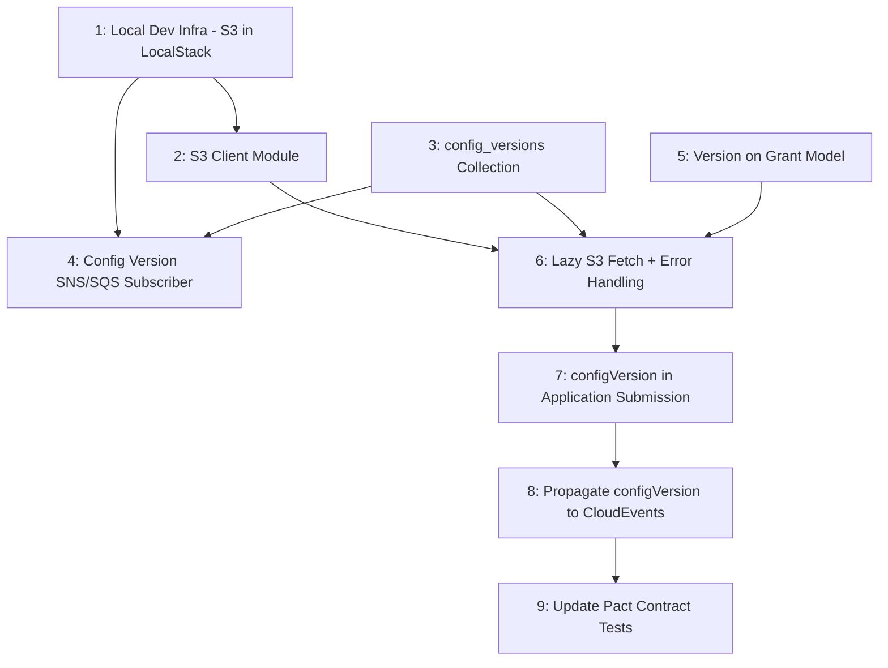

# Config Broker Integration - Implementation Tickets

---

## Parent Ticket

**Title:** Integrate GAS with Config Broker for versioned grant configuration

**Type:** Story / Epic

### Description

GAS currently stores grant definitions (phases, stages, statuses, actions, question schemas, external status maps) directly in MongoDB, managed via REST endpoints (`POST /grants`, `PUT /grants/{code}`). There is no versioning -- grants are identified only by `code`.

The Config Broker provides versioned, environment-specific configuration via S3 buckets with SNS notifications on new releases. This work integrates GAS with the Config Broker so that:

1. GAS maintains a local version catalog (`config_versions` MongoDB collection) populated by Config Broker SNS notifications, using the **existing inbox/outbox pattern** for reliable message processing with FIFO ordering, retries, and dead-letter handling
2. Grant definitions are lazily fetched from S3 when first needed by an application submission
3. Applications carry a `configVersion` (semver) that is resolved to the latest patch and propagated to all downstream systems (Caseworking, Agreements API)

### Architecture

Incoming application requests include a `configVersion` (e.g., `"1.2.0"`). GAS resolves the latest active patch for that major.minor from its local catalog (e.g., `"1.2.3"`), fetches the grant definition from S3 if not already cached, validates the application against it, and stores the resolved version on the application. All outbound events include the resolved `configVersion`.

```
Grants UI                        GAS                           S3 / Config Broker
    |                             |                                   |
    |-- POST /applications ------>|                                   |
    |   (configVersion: "1.2.0")  |                                   |
    |                             |-- Query config_versions --------->|
    |                             |   (latest patch for 1.2.x)        |
    |                             |<-- "1.2.3" -----------------------|
    |                             |                                   |
    |                             |-- Fetch from S3 (if not cached) ->|
    |                             |<-- grant-definition.json ---------|
    |                             |                                   |
    |                             |-- Validate + create application   |
    |                             |-- SNS: case.create (with 1.2.3) ->|  CW
    |<-- 204 --------------------|                                   |
```

### Error Handling Strategy

- **Hard fail, no fallback** -- if the resolved version cannot be fetched from S3, the request is rejected. GAS never silently falls back to a different version.
- **Reject fast, no inline retries** -- S3 failures are not retried within the same HTTP request. Transient errors (5xx/timeout) are retried on the next request. After 5 transient failures, the version is escalated to permanent error.
- See subtask 6 for the full error handling matrix.

### Permissions Required (prerequisites before development can begin)

- **S3 bucket read access** -- CDP support must grant GAS read access to the config S3 bucket
- **Config Broker API key + encryption key** -- Aaron Carroll to share with the team
- **SNS topic subscription** -- Config Broker SNS topic subscription for GAS's SQS queue

### New Environment Variables

- `CONFIG_BROKER_S3_BUCKET` -- S3 bucket name for config files
- `GAS__SQS__CONFIG_VERSION_QUEUE_URL` -- SQS queue for config update notifications

### Open Questions

1. Will each grant scheme have its own config repository, or will multiple schemes share one?
2. Should GAS respect draft/active status from the Config Broker, or treat all published versions as usable?
3. How will existing applications (created without a config version) be handled? Assume version `1.0.0`?
4. What format will grant definitions be stored in within the Config Broker (JSON, YAML)?
5. Should GAS do a one-time catalog sync from the Config Broker API at startup to catch missed SNS messages?
6. When a major version bump occurs, how does GAS handle in-flight applications on the old major version?
7. Is the real Config Broker SNS topic FIFO or standard? The local dev setup uses FIFO topics/queues with `grantCode` as the message group ID. If the production topic is standard (non-FIFO), the LocalStack setup and message group ID handling will need adjusting.

### Subtasks

| # | Title | Blocked by |
|---|-------|------------|
| 1 | Local dev infrastructure -- add S3 to LocalStack | -- |
| 2 | S3 client module | 1 |
| 3 | `config_versions` collection, model, and repository | -- |
| 4 | Config version SNS/SQS subscriber | 1, 3 |
| 5 | Add version to Grant model and repository | -- |
| 6 | Lazy S3 fetch with error handling | 2, 3, 5 |
| 7 | Add `configVersion` to application submission flow | 6 |
| 8 | Propagate `configVersion` to downstream CloudEvents | 7 |
| 9 | Update Pact contract tests | 8 |

### Acceptance Criteria (parent ticket)

- [ ] GAS receives Config Broker SNS notifications and catalogs versions in MongoDB
- [ ] Application submissions include `configVersion`, resolved to the latest active patch
- [ ] Grant definitions are lazily fetched from S3 and cached in the `grants` collection
- [ ] S3 fetch failures are handled per the error matrix (hard fail, reject fast, no fallback)
- [ ] All outbound CloudEvents (case.create, agreement.create, case.update.status, application.created, application.status.updated) include `configVersion`
- [ ] Pact contract tests pass with `configVersion` in all message contracts
- [ ] Local development environment supports the full flow via LocalStack S3
- [ ] Existing applications and grants continue to work (backwards-compatible migrations)

---

## Dependency Graph



---

## Ticket 1: Local Dev Infrastructure - Add S3 to LocalStack

**Blocked by:** Nothing (can start immediately)

**Description:**
Add S3 support to the local development environment so developers can test Config Broker integration locally. Update LocalStack to provision an S3 bucket and seed it with a sample grant definition file.

**Scope:**
- Update `compose/start-localstack.sh` to create an S3 bucket (e.g., `config-broker-local`)
- Update `compose.yml` LocalStack `SERVICES` to include `s3` (currently `sqs,sns`)
- Add new env vars to `.env.example`: `CONFIG_BROKER_S3_BUCKET`
- Seed a sample grant definition JSON into the S3 bucket at a known path (e.g., `pigs-might-fly/1.0.0/grant-definition.json`) using the existing PMF fixture

**Files to change:**
- `compose/start-localstack.sh`
- `compose.yml`
- `.env.example`
- `src/common/config.js` (add `CONFIG_BROKER_S3_BUCKET` to schema)

**Acceptance Criteria:**
- [ ] `docker compose up` starts LocalStack with S3 enabled
- [ ] S3 bucket `config-broker-local` exists after startup
- [ ] Sample grant definition file is accessible at the expected S3 key
- [ ] `aws s3 ls s3://config-broker-local/ --profile localstack` returns the seeded file
- [ ] Existing SNS/SQS functionality is unaffected

---

## Ticket 2: S3 Client Module

**Blocked by:** Ticket 1

**Description:**
Create a reusable S3 client module for fetching and parsing grant definition files from the Config Broker's S3 bucket. This is the low-level fetch layer used by the lazy-fetch logic in Ticket 6.

**Scope:**
- Add `@aws-sdk/client-s3` dependency
- Create `src/common/s3-client.js` with a `fetchConfigFile(bucket, key)` function that:
  - Calls `GetObjectCommand`
  - Streams and parses the response body as JSON
  - Returns the parsed object on success
  - Throws typed errors for S3 failures (distinguish 404, 403, 5xx, parse errors)
- Add S3 path construction helper: `buildS3Key(grantCode, version)` that returns the expected key pattern

**Files to change:**
- `package.json` (add `@aws-sdk/client-s3`)
- New: `src/common/s3-client.js`
- New: `src/common/s3-client.test.js`

**Acceptance Criteria:**
- [ ] `fetchConfigFile` returns parsed JSON when the S3 object exists and is valid
- [ ] `fetchConfigFile` throws a distinguishable error when the key does not exist (404)
- [ ] `fetchConfigFile` throws a distinguishable error for access denied (403)
- [ ] `fetchConfigFile` throws a distinguishable error for invalid JSON content
- [ ] `fetchConfigFile` throws a distinguishable error for S3 service errors (5xx/timeout)
- [ ] `buildS3Key("woodland", "1.2.3")` returns the expected path string
- [ ] Unit tests pass with mocked S3 client covering all scenarios above
- [ ] Integration test fetches from LocalStack S3 (seeded in Ticket 1)

---

## Ticket 3: `config_versions` Collection, Model, and Repository

**Blocked by:** Nothing (can start immediately, parallel with Tickets 1 and 2)

**Description:**
Create the `config_versions` MongoDB collection that acts as GAS's local catalog of all known config versions published by the Config Broker. This collection is the source of truth for version resolution.

**Scope:**
- Create migration to add `config_versions` collection with indexes:
  - Unique: `{ grantCode: 1, version: 1 }`
  - Query: `{ grantCode: 1, major: 1, minor: 1, patch: -1, status: 1 }`
- Create `src/grants/models/config-version.js` with fields: `grantCode`, `version`, `major`, `minor`, `patch`, `status`, `s3Key`, `s3Bucket`, `receivedAt`, `fetchedAt`, `fetchStatus`, `fetchError`, `fetchAttempts`, `lastFetchAttemptAt`
- Create `src/grants/repositories/config-version.repository.js` with methods:
  - `upsert(configVersion)` -- insert or update on `{ grantCode, version }`
  - `findLatestPatch(grantCode, major, minor)` -- returns highest patch with `status: "active"` and `fetchStatus !== "permanent_error"`
  - `updateFetchStatus(grantCode, version, fetchStatus, fetchError)` -- update fetch state after S3 attempt

**Files to change:**
- New: `migrations/YYYYMMDD-create-config-versions.js`
- New: `src/grants/models/config-version.js`
- New: `src/grants/models/config-version.test.js`
- New: `src/grants/repositories/config-version.repository.js`
- New: `src/grants/repositories/config-version.repository.test.js`

**Acceptance Criteria:**
- [ ] Migration creates the `config_versions` collection with both indexes
- [ ] `upsert` inserts a new version record with `fetchStatus: "pending"`
- [ ] `upsert` on a duplicate `{ grantCode, version }` updates the existing record (no duplicate error)
- [ ] `findLatestPatch("woodland", 1, 2)` returns the record with the highest `patch` value where `status: "active"`
- [ ] `findLatestPatch` skips records with `fetchStatus: "permanent_error"`
- [ ] `findLatestPatch` returns `null` when no matching `major.minor` exists
- [ ] `updateFetchStatus` correctly updates `fetchStatus`, `fetchError`, `fetchAttempts`, and `lastFetchAttemptAt`
- [ ] Unit tests cover model validation
- [ ] Integration tests cover all repository methods

---

## Ticket 4: Config Version SNS/SQS Subscriber (using existing inbox pattern)

**Blocked by:** Tickets 1 and 3

**Description:**
Create a new SQS subscriber that listens for Config Broker version notifications and processes them using GAS's **existing inbox/outbox pattern**. This ensures Config Broker messages get the same reliable, ordered processing as case status and agreement updates -- including FIFO locking, retries, and dead-letter handling.

The existing pattern in GAS:
1. `SqsSubscriber` polls the SQS queue and calls `saveInboxMessageUseCase` to persist the raw message to the **inbox** collection
2. `InboxSubscriber` polls the inbox, claims messages with FIFO locks, and dispatches to a handler based on message type/source
3. Failed messages are retried up to `INBOX_MAX_RETRIES`, then dead-lettered

This ticket follows that same pattern rather than having the SQS subscriber write directly to `config_versions`.

**Scope:**
- Add new env vars: `GAS__SQS__CONFIG_VERSION_QUEUE_URL`
- Update `src/common/config.js` with the new SQS queue URL
- Create `src/grants/subscribers/config-version-updated.subscriber.js` (SQS poller) that:
  - Polls the config version SQS queue
  - Calls `saveInboxMessageUseCase` with a source identifier (e.g., `"CONFIG_BROKER"`) to persist the message to the inbox collection
- Add a handler in `InboxSubscriber.handleEvent` (or the equivalent dispatch logic) for Config Broker messages that:
  - Parses the notification to extract `grantCode`, `version`, `status`
  - Parses version string into `major`, `minor`, `patch` integers
  - Constructs the S3 key using `buildS3Key`
  - Upserts into `config_versions` via the repository
  - Marks the inbox event as complete on success, or failed on error (triggering retry)
- Register the SQS subscriber in `src/grants/index.js` (start/stop lifecycle)
- Update `compose/start-localstack.sh` to create the new SQS queue

**Files to change:**
- `src/common/config.js`
- `.env.example`
- New: `src/grants/subscribers/config-version-updated.subscriber.js`
- New: `src/grants/subscribers/config-version-updated.subscriber.test.js`
- `src/grants/subscribers/inbox.subscriber.js` (add handler dispatch for Config Broker source)
- `src/grants/use-cases/save-inbox-message.use-case.js` (if source mapping needs updating)
- `src/grants/index.js` (register SQS subscriber)
- `compose/start-localstack.sh` (create SQS queue)

**Acceptance Criteria:**
- [ ] SQS subscriber starts and stops with the Hapi server lifecycle
- [ ] Config Broker messages are persisted to the **inbox** collection via `saveInboxMessageUseCase` (not written directly to `config_versions`)
- [ ] `InboxSubscriber` processes Config Broker messages from the inbox with the existing FIFO lock, retry, and dead-letter semantics
- [ ] On successful processing, a `config_versions` record is created with `fetchStatus: "pending"`
- [ ] Version string `"1.2.3"` is correctly parsed into `major: 1, minor: 2, patch: 3`
- [ ] Invalid version strings cause the inbox event to be marked as failed (retried, then dead-lettered after max retries)
- [ ] Duplicate messages for the same `grantCode + version` do not create duplicate `config_versions` records (upsert)
- [ ] S3 key is correctly constructed from `grantCode` and `version`
- [ ] Integration test: publish message to LocalStack SQS, verify it flows through inbox and appears in `config_versions`

---

## Ticket 5: Add Version to Grant Model and Repository

**Blocked by:** Nothing (can start immediately, parallel with Tickets 1-4)

**Description:**
Add a `version` field to the `Grant` model and `GrantDocument`, and update the repository to support looking up grants by `code + version`. Migrate existing grants to a default version.

**Scope:**
- Add `version` field to `Grant` constructor and `GrantDocument`
- Update `grant.repository.js`:
  - `save` and `replace` include `version`
  - New `findByCodeAndVersion(code, version)` method
  - Existing `findByCode` still works (for backwards compatibility during migration)
  - Add compound unique index on `{ code: 1, version: 1 }`
- Create migration to add `version: "1.0.0"` to all existing grant documents and create the new index
- Update `createGrantUseCase` and `replaceGrantUseCase` to accept optional `version`

**Files to change:**
- `src/grants/models/grant.js`
- `src/grants/models/grant-document.js`
- `src/grants/repositories/grant.repository.js`
- `src/grants/repositories/grant.repository.test.js`
- `src/grants/use-cases/create-grant.use-case.js`
- `src/grants/use-cases/replace-grant.use-case.js`
- New: `migrations/YYYYMMDD-add-version-to-grants.js`

**Acceptance Criteria:**
- [ ] `Grant` model accepts and stores a `version` string
- [ ] `GrantDocument` includes `version` in its persisted fields
- [ ] `findByCodeAndVersion("woodland", "1.2.3")` returns the correct grant
- [ ] `findByCodeAndVersion` returns `null` when the version does not exist
- [ ] Two grants with the same code but different versions can coexist
- [ ] Migration sets `version: "1.0.0"` on all existing grant documents
- [ ] Migration creates the `{ code, version }` compound unique index
- [ ] Existing unit and integration tests still pass (backwards compatible)

---

## Ticket 6: Lazy S3 Fetch with Error Handling

**Blocked by:** Tickets 2, 3, and 5

**Description:**
Implement the fetch-decision service that resolves a config version, fetches the grant definition from S3 if needed, and handles all error scenarios. This is the core logic that sits between the `config_versions` catalog and the `grants` collection.

**Scope:**
- Create `src/grants/services/resolve-config-version.service.js` with a `resolveAndFetchGrant(grantCode, requestedVersion)` function that:
  1. Parses `requestedVersion` into `major.minor`
  2. Queries `config_versions` for the latest active patch
  3. Returns immediately if `fetchStatus === "fetched"` and grant exists in `grants` collection
  4. Rejects if `fetchStatus === "permanent_error"`
  5. Escalates to `permanent_error` if `fetchAttempts >= 5`
  6. Attempts S3 fetch for `"pending"` or `"transient_error"` statuses
  7. On success: stores grant in `grants` collection, updates `fetchStatus` to `"fetched"`
  8. On S3 404/403/invalid content: sets `fetchStatus` to `"permanent_error"`
  9. On S3 5xx/timeout: sets `fetchStatus` to `"transient_error"`, increments `fetchAttempts`
- Use appropriate Boom errors for each rejection scenario (404, 422, 502, 503)

**Files to change:**
- New: `src/grants/services/resolve-config-version.service.js`
- New: `src/grants/services/resolve-config-version.service.test.js`

**Acceptance Criteria:**
- [ ] Returns the grant when `fetchStatus` is `"fetched"` (no S3 call)
- [ ] Fetches from S3 and stores the grant when `fetchStatus` is `"pending"`
- [ ] Retries fetch when `fetchStatus` is `"transient_error"` and `fetchAttempts < 5`
- [ ] Rejects with `Boom.notFound` when no `major.minor` match exists in the catalog
- [ ] Rejects with `Boom.badGateway` when `fetchStatus` is `"permanent_error"`
- [ ] Sets `fetchStatus` to `"permanent_error"` when S3 returns 404
- [ ] Sets `fetchStatus` to `"permanent_error"` when S3 returns 403
- [ ] Sets `fetchStatus` to `"permanent_error"` when S3 content is invalid JSON
- [ ] Sets `fetchStatus` to `"transient_error"` when S3 returns 5xx/timeout
- [ ] Escalates to `"permanent_error"` when `fetchAttempts >= 5`
- [ ] Logs at `error` level for all fetch failures with `grantCode`, `version`, `s3Key`
- [ ] Unit tests cover every row in the error handling matrix (mocked S3 + repos)

---

## Ticket 7: Add `configVersion` to Application Submission Flow

**Blocked by:** Ticket 6

**Description:**
Update the application submission flow to accept a `configVersion` from the caller, resolve the latest patch, and store the resolved version on the application.

**Scope:**
- Add `configVersion` (semver string) to `submitApplicationRequestSchema`
- Add `configVersion` field to the `Application` model and its constructor
- Update `createApplicationUseCase` to:
  1. Call `resolveAndFetchGrant(code, configVersion)` from Ticket 6
  2. Use the returned grant for validation instead of `findGrantByCodeUseCase`
  3. Store the resolved version on the application
- Update `replaceApplicationUseCase` similarly
- Create migration to add `configVersion: null` to existing application documents

**Files to change:**
- `src/grants/schemas/requests/submit-application-request.schema.js`
- `src/grants/models/application.js`
- `src/grants/use-cases/create-application.use-case.js`
- `src/grants/use-cases/replace-application.use-case.js`
- New: `migrations/YYYYMMDD-add-config-version-to-applications.js`

**Acceptance Criteria:**
- [ ] `POST /grants/{code}/applications` accepts `configVersion` in the request body
- [ ] Request is rejected with 400 if `configVersion` is missing or not a valid semver string
- [ ] Application is created with the resolved version (e.g., sends `"1.2.0"`, gets `"1.2.3"`)
- [ ] The resolved `configVersion` is persisted on the application document in MongoDB
- [ ] Application answers are validated against the grant definition for the resolved version
- [ ] Replacement applications also resolve and store `configVersion`
- [ ] Request returns 404 when no matching `major.minor` exists in the catalog
- [ ] Request returns 502/503 when the grant definition cannot be fetched from S3
- [ ] Migration adds `configVersion: null` to existing applications without errors
- [ ] Existing unit and integration tests are updated and pass

---

## Ticket 8: Propagate `configVersion` to Downstream CloudEvents

**Blocked by:** Ticket 7

**Description:**
Include `configVersion` in all outbound CloudEvent commands and events so downstream systems (Caseworking, Agreements, listeners) know which config version was used.

**Scope:**
- Update `CreateNewCaseCommand` to include `configVersion` in `data.payload`
- Update `CreateAgreementCommand` to include `configVersion` in `data`
- Update `UpdateCaseStatusCommand` to include `configVersion` in `data.supplementaryData`
- Update `ApplicationCreatedEvent` to include `configVersion` in `data`
- Update `ApplicationStatusUpdatedEvent` to include `configVersion` in `data`

**Files to change:**
- `src/grants/commands/create-new-case.command.js`
- `src/grants/events/create-agreement.command.js`
- `src/grants/commands/update-case-status.command.js`
- `src/grants/events/application-created.event.js`
- `src/grants/use-cases/create-status-transition-update.use-case.js`
- Unit test files for each of the above

**Acceptance Criteria:**
- [ ] `CreateNewCaseCommand` payload includes `configVersion` from the application
- [ ] `CreateAgreementCommand` payload includes `configVersion` from the application
- [ ] `UpdateCaseStatusCommand` supplementary data includes `configVersion`
- [ ] `ApplicationCreatedEvent` data includes `configVersion`
- [ ] `ApplicationStatusUpdatedEvent` data includes `configVersion`
- [ ] Unit tests verify each event/command contains `configVersion` when constructed from an application that has one
- [ ] Events from applications without `configVersion` (pre-migration) do not break (graceful null handling)

---

## Ticket 9: Update Pact Contract Tests

**Blocked by:** Ticket 8

**Description:**
Update consumer and provider Pact contract tests to include `configVersion` in all message contracts between GAS and downstream systems.

**Scope:**
- Update `test/contract/provider.cw-backend.test.js`:
  - Add `configVersion` to mock applications in `CreateNewCaseCommand` provider tests
  - Add `configVersion` to `UpdateCaseStatusCommand` provider tests
- Update `test/contract/provider.agreements-api.test.js`:
  - Add `configVersion` to `CreateAgreementCommand` provider tests
- Update `test/contract/consumer.cw-backend.test.js`:
  - Add `configVersion` to expected message shape for case status updates from CW
- Update `test/contract/consumer.agreements-api.test.js`:
  - Add `configVersion` to expected message shape for agreement events

**Files to change:**
- `test/contract/provider.cw-backend.test.js`
- `test/contract/provider.agreements-api.test.js`
- `test/contract/consumer.cw-backend.test.js`
- `test/contract/consumer.agreements-api.test.js`

**Acceptance Criteria:**
- [ ] `npm run test:contract:local` passes with `configVersion` in all message contracts
- [ ] Provider tests for CW include `configVersion` in `CreateNewCaseCommand` and `UpdateCaseStatusCommand` messages
- [ ] Provider tests for Agreements include `configVersion` in `CreateAgreementCommand` messages
- [ ] Consumer tests for CW include `configVersion` as an expected field in incoming status events
- [ ] Consumer tests for Agreements include `configVersion` as an expected field in incoming agreement events
- [ ] `configVersion` is matched with `like()` (type matching) to allow any semver string value
