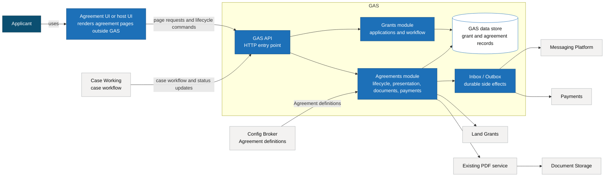

# Agreements GAS supporting detail

This supports [Lightweight Decision Record - Config-based Agreements in GAS](./ldr-001-config-based-agreements-in-gas.md).

## Proposed model

Agreements should move into GAS as a separate module next to Grants. It should not be folded into grant workflow code.

GAS will own the agreement logic: creating offers, generating agreement numbers, resolving render models, recording acceptance or cancellation, creating payment requests, and publishing agreement events.

Agreement definitions are keyed by Agreement code. They select the processing rules, pages, bindings, actions, payment behaviour and PDF behaviour for that code. Config Broker is the target source for those definitions. PMF can use in-process definitions first while we prove the contract.

Agreement code is the selector for agreement behaviour. It should come from the grant or case workflow that created the agreement offer. Scheme stays as a label on an agreement version; it is not the selector for behaviour.

This follows existing patterns:

- GAS uses grant/application code to select grant behaviour and publish grant status.
- Case Working uses workflow code to load definitions, pages, tasks and transitions.
- Agreements should use Agreement code to select the Agreement definition, lifecycle, processing and pages.

## Pages

Agreement pages should follow the Case Working approach. Pages are configuration, not hard-coded journeys.

Agreement definitions should define page IDs, routing metadata, headings, labels, declarations, links, sections, bindings, conditions, actions and PDF behaviour. GAS exposes this as an agreement page/action model that a UI outside GAS can render. The UI should not contain journey logic for individual Agreement types.

Definitions are versioned so an accepted agreement can be reproduced from the definition used when it was created. Store Agreement version data, definition version, generated document reference and audit facts. Do not treat the rendered page model as the durable record.

The renderer should be reusable. It could be a shared library used by host UIs, or a standalone Agreement UI service that uses the same page/action model. Forms Engine compatibility may help, but the agreement UI should not be locked to Grants UI rendering.

Page composition sits in configuration. Rendering rules and validation stay in code.

## UI hosting

GAS stays as a backend service. Agreement pages are rendered by a UI outside GAS.

For API-first migration, the current Agreements UI remains the first caller. It calls GAS for PMF and later migrated Agreement codes. Unmigrated live Agreement codes continue to use the current Agreements API. This moves data and agreement logic into GAS without changing the user-facing UI first.

Longer term, agreement rendering should be reusable. The likely options are a standalone Agreement UI service, a shared renderer library, a host UI adapter, or an iframe where other routes are not practical.

An iframe should be a fallback. It can separate ownership quickly, but it makes accessibility, browser history, focus management, printing, cookies, content security policy and error handling harder.

## Routing during migration

The current Agreements UI should keep its routes during the API-first move. It should ask GAS for agreement data, page state, available actions, document links and validation responses for Agreement codes routed to GAS.

During migration, the UI may keep a small routing rule: PMF and migrated Agreement codes go to GAS; live FPTT/WMP codes go to the current Agreements API. GAS still owns page state, available actions and action outcomes for codes routed to GAS.

If GAS cannot resolve the Agreement type or page/action mode for a GAS-routed Agreement, the UI should show an error rather than guess how to render or recover.

GAS should make the final access decision for agreement entry, actions and document downloads where the Agreement is routed to GAS. The UI should pass the authenticated user context or source identity it holds.

## Processing

Agreement processing should feel familiar to teams who know GAS grant processing.

Agreement definitions should define:

- valid statuses
- valid transitions
- external status mappings where needed
- named processes to run during transitions
- actions available for each lifecycle state or page

Named processes can cover version creation, agreement number handling, payment calculation, payment request creation, acceptance recording, status publishing, PDF requests, cancellation and termination.

Definitions select named GAS processes. They do not implement behaviour. Process implementations stay in code so they can be tested and reused across Agreement types. Use-cases say how each process runs. Domain models enforce the rules.

## Events and integrations

Agreement side effects should use the GAS inbox/outbox pattern. When agreement logic records a lifecycle change, the use-case records the new Agreement version and writes the required outbox records in the same transaction.

Payments, Land Grants, document storage, audit and status publishing stay durable and retryable.

External systems should sit behind adapters. Use-cases should depend on agreement capabilities, not remote payload details.

## PDFs

PDFs should be treated as agreement documents, not as UI templates with special routing.

There are two needs:

- **Printable agreement pages**: the agreement UI renders a print-friendly version of the page model returned by GAS. This is useful for draft offers and customer viewing.
- **Stored agreement PDFs**: GAS owns the document reference, retention metadata, access checks, audit event and download endpoint for accepted or generated agreement PDFs.

GAS should not generate the page shell for the browser. It should own the document facts: agreement number, version, document status, storage key, retention class, created date and download availability.

Print-only document chrome should be controlled by GAS through metadata on the form definition. For example:

```js
metadata: {
  documentChrome: {
    watermark: {
      label: "DRAFT";
    }
  }
}
```

The UI renders this as generic document chrome. It should not infer agreement statuses or decide when a draft watermark applies.

PDF generation should be event driven. When an agreement is accepted, GAS writes an outbox record requesting PDF generation or document storage. Once generated, the document reference is stored against the Agreement version. The UI shows a download action only when GAS says the PDF is available.

To reduce change, reuse the existing PDF service. GAS should integrate with it through a document adapter, using the agreement view URL or document request it expects today. PDF generation behaviour stays stable while Agreement logic moves into GAS.

During migration, preserve the current S3 key strategy, retention-prefix behaviour and PDF download contract until the teams agree a replacement. PDF service and storage details should sit behind a GAS document adapter, so the UI only asks GAS for the document link or stream.

## Target architecture view



## Migration

Treat this as a product and data migration, not a source-code port.

Start with Pigs Might Fly. Use the sample grant and case workflow to build the API-first path in GAS before moving existing agreements such as FPTT and WMP.

PMF should not be a thin demo. It should exercise the capabilities FPTT and WMP need:

1. **API and data**: GAS owns the agreement record, lifecycle logic, agreement number, version, definition version, access checks and API responses needed by the current Agreements UI.
2. **UI cutover**: the current Agreements UI calls GAS for create, view, accept, cancel, document and status flows instead of calling the Agreements API.
3. **Side effects and parity**: outbox records are written for payments, documents and status events; the existing PDF service is reused through a GAS document adapter; payment request behaviour can be configured and emitted; agreement status events can be published.

Use realistic test data rather than live FPTT/WMP migration data. The sample should include agreement number and versioning, SBI, agreement dates, payment schedule, document metadata, lifecycle transitions, repeatable page sections, acceptance and emitted events.

Once PMF works, use the same approach for FPTT and WMP: add their Agreement definitions, map their existing data, and compare GAS output with current behaviour.

Before migrating FPTT and WMP, run parity checks against current Agreements behaviour:

- Agreements UI to GAS API responses
- rendered agreement pages
- Agreement version data
- payment request payloads
- agreement status events
- PDF document references and download behaviour
- audit events
- error cases such as missing PDF, invalid transition, or already accepted offers

Before live agreements move, reconcile agreement numbers, versions, payment schedules, document references and lifecycle behaviour. Run the new GAS behaviour in parallel with current Agreements behaviour until the differences are understood and accepted.

Switch off the current Agreements service only after all Agreement types have moved to GAS, parity checks have passed, event publication and subscriptions have moved, and the agreed cutover checks are complete. Until then, keep the current service available for Agreement types that have not moved yet.
