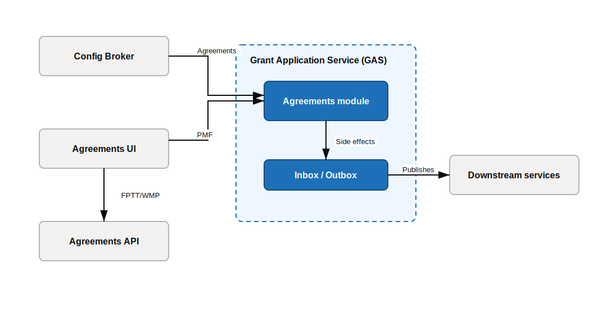

# Lightweight Decision Record - Config-based Agreements in GAS

|                  |                          |
| ---------------- | ------------------------ |
| status           | proposed                 |
| date             | 17 Jun 2026              |
| decision makers  | Justin Ramel             |
| people consulted | Martin Smith, Mark Stead |
| people informed  | Core Grants Team         |

## Context and Problem Statement

We want new agreements in GAS to be quicker to add. Most variation should live in configuration, not in bespoke API and UI code.

At the moment, Agreements sit outside GAS. The current Agreements API and Agreements UI own the data, lifecycle rules, side effects and rendering. That makes it hard for GAS to use Agreement definitions as the place where agreement behaviour varies. Config Broker is the target source for those definitions.

We need to decide how to move Agreement ownership into GAS without disrupting the applicant journey or breaking payments, documents, PDFs, status events, audit and access checks.

## Decision Drivers

- **Configuration over code**: new Agreement types should mainly use Agreement definitions and reusable GAS behaviour.
- **Clear ownership**: GAS should own Agreement data and logic.
- **Safe migration**: Pigs Might Fly should prove the path before live Agreement types move.
- **Downstream parity**: payments, documents, PDFs, status events, audit-equivalent facts and access checks must keep working.

## Considered Options

### 1. No change

Keep the current Agreements API and Agreements UI.

Good, because almost nothing changes now.

Bad, because each new Agreement type still needs API and UI service releases.

Bad, because new Agreement types are not config-based and take longer to implement.

### 2. API-first migration

Move the Agreements API capability into GAS, while keeping the current Agreements UI as the renderer during migration.

Good, because GAS can move to config-based Agreement logic without changing the Agreements UI first.

Good, because Pigs Might Fly can prove API parity before live Agreements move.

Bad, because the Agreement UI still needs to move to Grants UI later, so this does not complete the full migration.

### 3. UI and GAS migration

Extend Option 2 by also moving Agreement rendering into Grants UI in the same migration step.

Good, because it moves both UI and API ownership towards the intended end state.

Bad, because it is a larger first step than API-first migration.

Bad, because Grants UI does not currently support Entra ID, so this would require authentication changes before the migration.

### 4. Full rewrite

Rebuild the Agreements capability in one larger programme, including API, lifecycle, side effects and a new UI route.

Good, because it gives the cleanest end state.

Bad, because it has the highest delivery and migration risk.

Bad, because GAS does not currently have a user-facing UI.

## Decision Outcome

Option 2 - API-first migration.

We will move Agreement API behaviour, data and logic into GAS first. Pigs Might Fly (PMF) is the proof point for the config-based approach.

The current Agreements UI stays in place during migration. It calls GAS for the PMF Agreement, while live Agreements continue to use the current Agreements API.

FPTT and WMP move only after PMF proves API parity, agreement logic ownership and cutover confidence.

## Consequences

GAS owns Agreement data, logic and side effects for PMF first.

The first migration step is smaller because the current Agreements UI stays in place.

A later UI migration is still needed, either to Grants UI or to another reusable Agreement renderer.

Live Agreements stay on the current Agreements API until PMF proves parity and cutover confidence.

## Migration system view

## More Information

Supporting detail: [Agreements GAS supporting detail](./ldr-001-config-based-agreements-in-gas-supporting-detail.md).
